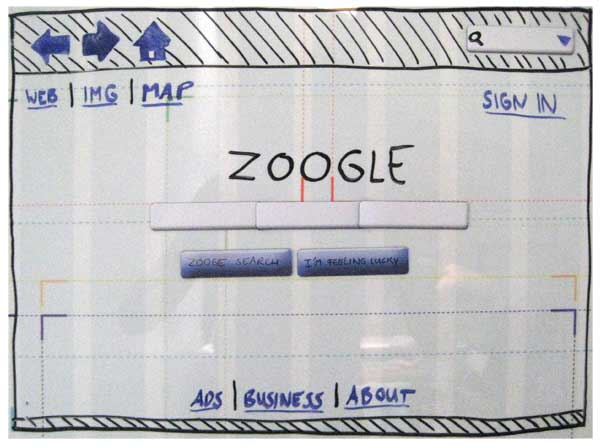
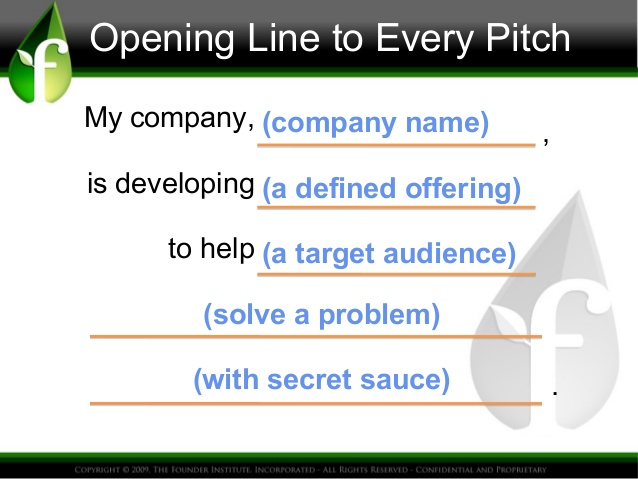
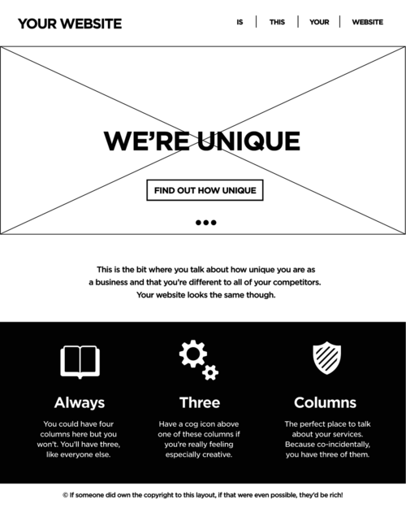

# From an idea to a MVP

---

# Who and Why

---

## You

---

## Me

* Martin Van Aken - [joyouscoding.com](joyouscoding.com)
* Software Developer since 15 years
* Co-founder of [PullReview](pullreview.com)
* Currently coach at [LeWagon](lewagon.org) and Freelance

---

## Why

* Moving my activity from big companies to startups
* Met a lot of business owners those last 6 months
* This is a summary/faqs from those discussions

---

# Agenda

1. What is an MVP
1. Before the software
1. MVP without coding
1. Developers
1. Ordering software

---

# What is an MVP

---

## Definition

* **Minimal**: not a dream, not even a v1
* **Viable**: able to attract/interest users
* **Product**: providing value (entertrainement/productivity/whatever)

---

## What it's not

* A fully defined product
* A test

---

### It has to be used by real users to be useful

---

## Why

---

### Validating your business (**audience, problem, solution**) as soon as possible

---

### Assumption: you cannot know everything from the start

---

### Assumption: you are willing to evolve

---

# Before the Software

---

## In the beginning

* An audience...
* ... with a problem...
* ... that is valuable to solve...
* ... and possible to solve

---

### Let's take that in order

---

## Identify the audience

---

### Some bad examples

* "This is for everyone"
* "We have three types of customers"

---

### Some good cases

* Pick an audience you know
* Be careful that **you are not your audience** even if you are in your audience

---

### Being specific is good

* Easier to find ("watering hole")
* More consistent in their problems
* You can't reach "everyone" anyway

---

### Best bet

The **knowledge of your audience** is the biggest thing you bring as a business founder (much more important than your idea).

---

## Interlude: About 'ideas'

* We talk a lot about ideas
* How to protect them
* How valuable their are

---

### They are not so valuable

* They are only about the solution
* They will probably change
* Execution matter much more

---

### You should talk more than protect them

* Get feedback
* You are not your idea
* You have much more than your idea

---

### What is -your- audience ?

---

## Identify the problem

---

### What we are looking for

* It may not be the one you think
* There may be a bigger one
* Needs to be there AND worth solving

---

### Problem interviews

* 15-30 minutes interviews
* In person or call (avoid surveys)
* 12-15 interviews

---

### Example Script

* Welcome
* Demographics / Ice breaker
* Story
* Problem Ranking
* Today's situation
* Thanks and ask

See a more complete version [here](http://startitup.co/guides/285/problem-interview-script)

---

### Efficiency

* 15 * 30 minutes = **7,5 hours**
* After 6-8, people start repeating themselves.
* That's **very cheap** to validate your business

---

### Added benefits

* Start connecting to your audience
* Create a possible alpha user list

**No reason not to do them.**

---

### What problem are -you- attempting to solve?

---

## Identify a solution

---

### Ask the prospect to dream

* Let's imagine that this is working
* Would it solve your problem?
* Would you pay for it?

---

### Mockups

---

### Mockups

* Create a story board on paper
* **Play it** before your prospect
* Updating mockup is incredibly **cheap**
* Those will be useful for later anyway

---

## Audience, Problem, Solution

---

### Pitch as a summary

---

### Example

 My company, **LeWagon** 
 is developping **a 9 week coding bootcamp** 
 to help **entrepreneurs** 
 to **get their first MVP out** 
 by **developing it themselves with our coaches help**

---

### Let's try!

---

# MVP without (much) coding

* No one said an MVP should involve coding.
* It’s not the quality of your software that will make your first users come

---

## A blog

A blog is the "perfect" MVP

* Targets a specific audience
* Brings them value regarding a specific problem they have

---

### Added benefits

* Way to gain credibility
* Way to collect interest
* When you software will be ready, you'll have an audience convinced you can bring them something

---

### Evaluate

* Comments
* Visits (using the blog platform or Google Analytics)

---

### Warning

* Creating a community takes time
* A blog "warm-up" is often 6 months
* It's a marathon, not a sprint

---

## Landing page

---

---

### Single page with key elements

* Audience (they need to understand this is for them)
* Problem
* Hint at the solution
* CTA: "leave us your email"

---

### Benefits

* Test/update message (analytics!)
* Collect interested emails

---

### How

* Services like [Launchrock](launchrock.com)/[unbounce.com](Unbounce)
* CMS (see next point)
* Technologies needed (HTML/CSS) can be learned in a couple of days
* Themes

---

## Packages

---

### CMS

* Allow you to create a full website in "point and click" mode
* Lots of themes for the look and feel
* Lots of plugin for various functionalities (forms, emails, etc)
* Hosting available
* Example: [Wordpress](wordpress.com], [Drupal](drupal.org)

---

### Warning

* Cost to learn the platform
* Difficult if you want to customize a lot

---

# Developers

---

## Technical Cofounders

I'm starting a band. I can't really play any instrument or sing, so I'm looking for a few musical co-founders.

- [Ryan Greenberg](https://twitter.com/greenberg/status/204294460421586947)

---

### Startup

A startup is a company who's main product is a software.

---

### Are you looking for a Cofounder? (1)

If you are not ready to let shares go, you’re not looking for a Cofounder - you are looking for a developer but you don’t want to pay.

---

### What about 50%?

I'll be building the software, what are you bringing? (hint: "the idea" is not a good answer)

---

### Are you looking for a Cofounder? (2)

If you have defined everything business-wise, you’re not looking for a Cofounder - you are looking for a developer but you don’t want to pay.

---

### You are not going to find one

Only 25% of founders are technical. Most of those have ideas themselves they want to make happen.

---

## Freelances

---

### Pros

* Used to deliver
* Experimented
* Can stop/encore when you want
* Can switch for other skills

---

### Cons

* Hopping between projects
* Expensives (day rate)
* Quickly to 5-10K

---

## Employees

---

### Pros

* Dedicated
* Depends on experience level

---

### Cons

* Single set of skills
* Not easy to let go/start again
* Expensive (total)
* Single bullet

---

# Ordering Software

---

## The Grim Situation

---

### The Disaster Recipe

* Software is expensive
* Business owners are bad at requirements
* Developers are bad at estimations
* Business owners and developers are not speaking the same language

---

### Some statistics

Software costing 15M+ are typically:

* 7% late
* 45% overbudget
* delivering only 44% of the functionalities

[McKinsey Study](http://blogs.gartner.com/mark_mcdonald/2012/10/29/mckinsey-report-highlights-failure-of-large-projects-why-it-is-better-to-be-small-particularly-in-it/)

---

### Size matters

The more complex the software, the biggest problems we get in requirements and estimations.

This is not linear - it's exponential.

---

### Fixed price

* Looks like a good idea
* Almost impossible for all but the simplest (= shortest) projects
* Risky: Who decide if/when it is "done"?

---

## What works

* Keep the project small
* Split them into smaller tasks
* Discuss on working software more than requirements
* Every task should have a user-observable result

---

## User Stories

---

### Definition

* A way to describe a single functionality of your software
* One sentence

---

### Template

As a **user category** I want **given functionality** so I can get **benefit**

---

### Why

* Simple
* Put the user first
* Observable
* Force to think about the benefit

---

## Mockups (again)

---

### What

* Show how the application should look like
* Show the interactions (clicking here leads there)
* It should not be pretty (big boxes are good)

---

### Why

* Helps a lot understanding the stories
* Give design guidelines

---

### Inspiration

* Look at existing sites
* Doing things the same way as others helps everyone
* Keep it simple

---

### Mobile

* More mobile than desktop traffic today
* When doing mockups, think about smallscreens!

---

## Short iterations

---

### Setup

* Create a list of stories
* Prioritize them

---

### Progress

* Developer take each story one after the other
* Question are asked when needed (requires collaboration)
* Software is deployed regularly

---

### Demo

* Demo every X days (not after X stories) - X < 10
* Discuss of the stories done, give feedback
* Rinse and repeat

---

### Pros

* Feedback loop is short
* You see (and test!) your software evolving week after week
* Easier to steer the course
* Any misunderstanding will be catched quickly

---

### Cons

* You need to work to create those "small stories"
* You don't have a clear date when the software will be "done"...

... but you would not have it anyway

---

## Some bad signs

* Your developer is talking in technical terms (setting up a database, validating something, etc)
* You are not seeing a working version of your software on a regular basis

---

## We're talking about an MVP

* Doing this will require you to split/axe your initial idea to something much humbler
* Think of it as a first step
* Put users on it, collect their feedback
* Rinse & Repeat

---

## Tooling

* [Trello](trello.com) for User Stories follow up
* Pen & Paper for mockups

---

# Thanks!

### Any feedback is most welcome: [martin@joyouscoding.com](martin@joyouscoding.com)

Slides are available here [joyouscoding.com/workshop-mvp/](http://joyouscoding.com/workshop-mvp/)

---

# References

Most of this comes from various sources:

* Ash Maurya "Running Lean"
* Eric Ries "The Lean Startup"
* Steve Blank "Four Steps to Epiphany"
* Adeo Ressi "One sentence pitch"
